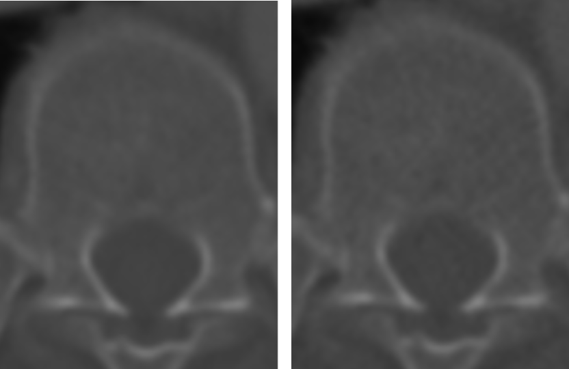
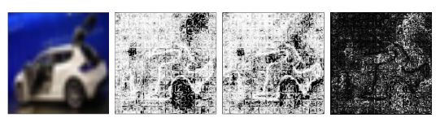
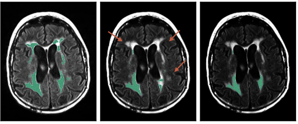
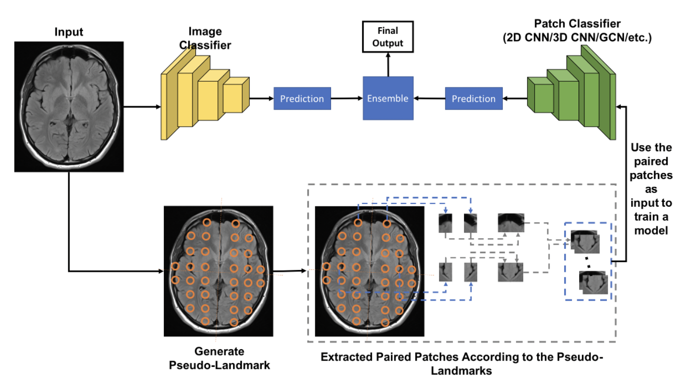
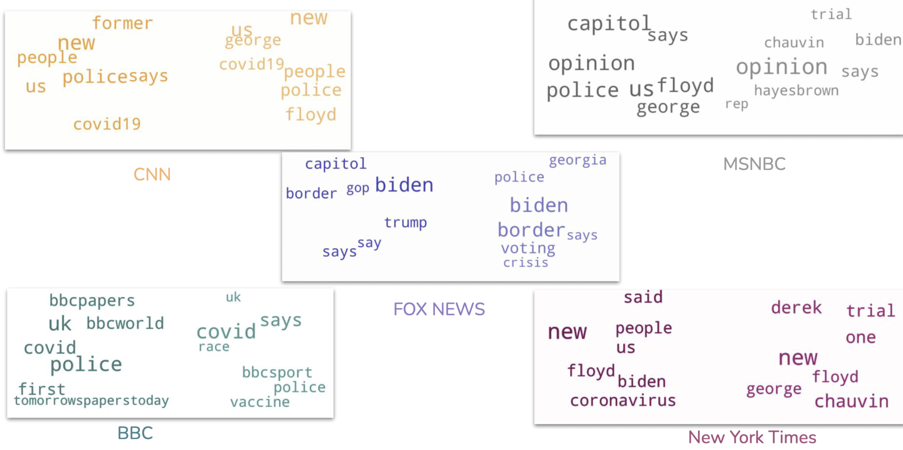

### Yunni Qu

# About
> I'm an undergraduate student in the department of Computer Science at the University of Toronto studying Data Science. My goal is to use methods in Computer Science to solve real world problems. My research interests include: Deep Learning model explainability, Computer Vision, Medical Imaging.    
> 

# Papers

>**Beware the Black-Box of Medical Image Generation: An Uncertainty Analysis by the Learned Feature Space**  
>**Yunni Qu**, David Yan, Eric Xing, Fengbo Zheng, Jie Zhang, Liangliang Liu, Gongbo Liang.  
>Accepted to 44TH IEEE International Engineering in Medicine and Biology Conference (EMBC 2022)    
>> As a black-box, DNNs usually produce a relatively stable performance on the same task across multiple training trials. However, the learned feature spaces could be significantly different between training trials. We believe additional insightful analysis, such as uncertainty analysis of the learned feature space, is equally important, if not more. Through this work, we evaluate the learned feature space of multiple U-Net architectures for image generation tasks using computational analysis and clustering analysis methods.

>**"Neural Network Decision-Making Criteria Consistency Analysis via Inputs Sensitivity"**  
>Eric Xing, Liangliang Liu, Xin Xing, **Yunni Qu**, Nathan Jacobs and Gongbo Liang.  
>Accepted to 26TH International Conference on Pattern Recognition (ICPR 2022)
>> Empirically, NNs usually produce a stable overall performance on the same task across multiple training trials. However, the decision-making criteria learned by the training trials are often significantly different, which raises concerns about the correctness and validity of the decision-making criteria. When the criteria are not correct or comprehensive, high-performance models may produce catastrophes leading to immense loss. We believe achieving consistent criteria between different training trials is the first step to discovering the importance of the decision-making criteria of NNs, which is equally important to achieving high performance, if not more. Through this work, we evaluate the decision-making criteria of NNs via inputs sensitivity using feature-attribution explanation methods in combination with computational analysis and clustering analysis.

# Projects

>**Robustness of 3D Segmentation Models for MRI Images**
>>Automated diagnosis using features learned from medical images have become a trend in recent years. Deep learning models, with their impressive  performance on segmentation and classification tasks, are becoming more and more widely used in medical imaging analysis.  While deep learning models are able to achieve accurate results, they are more easily tricked into making predictions based on irrelevant features than human eyes. This makes testing robustness of the models extremely important when it comes to medical image analysis. In this project, the robustness was benchmarked for deep learning models performing classification and segmentation tasks on MRI and CT datasets. To test the robustness of the model, new data sets were simulated from the original clean dataset by applying transformations with different severity levels to the clean dataset. DSC and HD95 were used to evaluate the models.

>**Symmetry Based Alzheimer's Diagnose**  
>>This project aims to see if the symmetric information of human brain structure can improve Alzheimer's disease diagnosis results. A multibranch 2D CNN is used to predict Alzheimer's disease based on brain tissue MRI of the patients. One branch uses the regular special information of MRI to diagnose AD. The other branch aims to use symmetric information. 

>**A topic analysis of News Networks with Twitter data**
>>An almost universal phenomenon today is the rapid communication of information. We are all interested in the latest news around the world, usually obtained from various media networks, but have you ever wondered how they compare? In this project we are interested in finding the differences in topics reported by these news networks and how subjective and polarizing their information is. To do this, we extracted tweets from their official Twitter accounts with Tweetpy API. To get the popular topics for each network, we used the Latent Dirichlet Allocation (LDA) model. This unsupervised model finds the topics for the tweets by backtracking which topic that could generate the tweet.

# Awards
> - 2022 American Statistical Association DataFest University of Toronto **Best Visualization Winner**
> - University of Toronto Faculty of Art and Science **Dean's list Scholar** 2020-2022

# MISC.
### Relevant Courses
>
> - CSC343 Introduction to Databases (Mark Kazakevich)
> - CSC384 Introduction to Artificial Intelligence (Sheila Mcilraith)
> - CSC494 Independent Project in Computer Science (Benjamin Haibe-Kains)
> - STA314 Statistical Machine Learning - Python (Chris Maddison)
> - CSC207 Software Design - Java (Lindsey Shorser)
> - CSC236 Introduction to Theory of Computation (Francois Pitt)
> - CSC263 Data Structures & Analysis (Michelle Craig)
> - JSC270 Data Science I - Python (Anna Goldenberg)
> - MAT237 Multivariable Calculus (Asif Zaman)
> - MAT223 Linear Algebra I (Jason Seifken)

